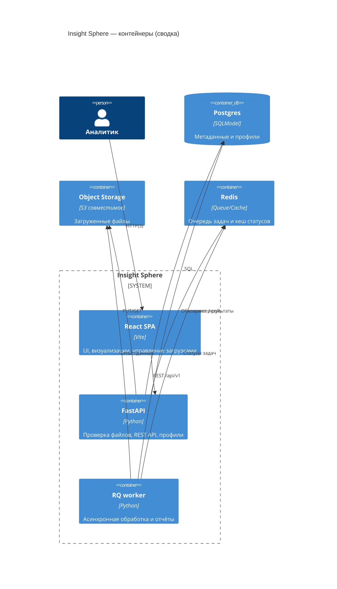

## Обзор

Проект собирает экспериментальную витрину данных с веб-интерфейсом на React и API на FastAPI.
Этот документ дополняет инструкции по запуску обзором архитектуры, ключевых возможностей,
планами развития и руководством для контрибьюторов.


### Кратко о системе

- **Назначение.** Импорт табличных данных, быстрые инсайты и углублённая аналитика на базе
  фоновых задач.
- **Стек.** Frontend на React/Vite, Backend на FastAPI + SQLModel, очередь Redis/RQ, Postgres и
  объектное хранилище для файлов.
- **Контракты.** OpenAPI схема, Pact-тесты и снапшоты обеспечивают предсказуемость интеграций.

## Архитектура

Система построена вокруг SPA на React, которое общается с FastAPI через REST `/api/v1`. Backend
валидирует и сохраняет файлы, ставит задачи в Redis/RQ и обновляет метаданные в Postgres.
Подробные диаграммы и ADR доступны в [docs/architecture.md](docs/architecture.md).



**Потоки данных**

1. Пользователь загружает CSV/XLSX, backend валидирует расширение, размер и (опционально) сканирует
   ClamAV.
2. Файл сохраняется в объектном хранилище, метаданные фиксируются в Postgres.
3. «Быстрый» анализ возвращается синхронно, углублённые расчёты ставятся в очередь Redis/RQ.
4. Воркеры подхватывают задачи, читают файлы и обновляют профили, UI опрашивает `/api/v1/tasks/{id}`.

## Матрица возможностей

| Направление | Поддерживаемые возможности | Статус | Комментарии |
| --- | --- | --- | --- |
| Загрузка данных | CSV/TSV/XLS(X), лимиты размера, ClamAV, идемпотентность | ✅ Стабильно | Ограничивается `MAX_UPLOAD_SIZE_MB`, расширяемый whitelist форматов |
| Профилирование | Быстрый анализ (схемы, типы, статистики), асинхронные отчёты | ✅ Стабильно | Расширяемые задачи RQ с хранением в Postgres |
| Управление наборами | CRUD, версионирование метаданных, экспорт | 🟡 Beta | Переход на SQLModel/Postgres в Q2 2025 |
| Аналитика UI | Панели «Продвинутая аналитика», графы знаний, симуляции | 🟡 Beta | См. [docs/predictive_analytics_overview.md](docs/predictive_analytics_overview.md) |
| Дашборды и визуализации | Конструктор, шаблоны, сравнение версий | 🔜 В планах | Требования — [docs/dashboard_feature_specs.md](docs/dashboard_feature_specs.md) |
| Поиск и рекомендации | Фасетный и семантический поиск, теги, рекомендации | 🔜 В планах | Запланировано в Q4 2025+ |
| Безопасность и соответствие | RBAC, аудит, секреты, лимиты | 🛠️ В разработке | Требования см. в `docs/secrets.md`, чек-лист — [docs/security_backlog.md](docs/security_backlog.md) |

Легенда: ✅ — доступно в продакшене, 🟡 — ограниченная beta, 🔜 — запланировано, 🛠️ — активно
разрабатывается.

## Дорожная карта (сводка)

Детальная дорожная карта ведётся в [ROADMAP.md](ROADMAP.md) и GitHub Projects. Ключевые инициативы:

- **Now (Q1 2025).** Усиление инженерных практик, тестов и автоматизации релизов, настройка CI и
  повышение покрытия.
- **Next (Q2 2025).** Миграция на Postgres, внедрение Redis для кэша/очереди, укрепление безопасности
  API, ограничение загрузок и наблюдаемость.
- **Later (Q3–Q4 2025).** DevOps excellence, совместная работа (шаринг, уведомления), расширенная
  аналитика, фасетный поиск, мониторинг аномалий и дашборды.
- **Backlog.** Расширенные сценарии импорта, автогенерация описаний, безкодовые трансформации и
  глубокая аналитика.

Регулярные апдейты происходят на ежеквартальных review; предложить инициативы можно через issue
шаблоны.

## Как внести вклад

1. Ознакомьтесь с [CONTRIBUTING.md](CONTRIBUTING.md) и [CODE_OF_CONDUCT.md](CODE_OF_CONDUCT.md).
2. Форкните репозиторий, создайте ветку `feature/<topic>` и установите зависимости (`pip install -r
   requirements.txt`, `./scripts/install_frontend_deps.sh`).
3. Активируйте `pre-commit`, запустите `make dev` или `docker compose up` для окружения разработки.
4. Перед отправкой PR выполните чек-лист качества: линтеры, тесты, типизация, покрытие ≥80%.
5. Коммиты оформляйте в стиле Conventional Commits, PR сопровождать описанием, ссылками на issue и
   скриншотами UI-изменений.
6. Обновляйте документацию, CHANGELOG и roadmap при добавлении значимых функций, фиксируйте решения в
   `docs/adr`.

## Управление релизами

- Заголовки pull request-ов должны соответствовать [Conventional Commit](https://www.conventionalcommits.org/ru/v1.0.0/) — это проверяется GitHub Actions (`semantic-pull-requests`).
- После слияния в `main` [Release Drafter](.github/release-drafter.yml) обновляет черновик следующего релиза и группирует изменения по SemVer.
- Для публикации стабильной версии создайте аннотированный тег `vMAJOR.MINOR.PATCH` и запушьте его. Workflow [`publish-release`](.github/workflows/publish-release.yml) автоматически опубликует релиз на GitHub, используя описание из черновика.
- Версия приложения хранится в `backend/app/version.py`. Обновлять её и переносить записи из `CHANGELOG.md` помогает утилита `./scripts/bump_version.py <major|minor|patch>` — она откажется работать, если секция `Unreleased` пуста.
- После публикации синхронизируйте `CHANGELOG.md`, перенеся записи из секции `Unreleased` в новую версию.

## Быстрый старт

1. Склонируйте репозиторий и установите зависимости для фронтенда и бэкенда.
2. Поднимите сопутствующие сервисы одной командой `make dev` (внутри используется `docker compose`).
   Стек включает Postgres, Redis, Unleash для фич-флагов, backend и frontend. Миграции Alembic и
   сидинг фикстур выполняются автоматически при старте контейнера бэкенда.
3. Остановите окружение командой `make down`.
4. Выполните автоматические тесты и линтеры через `make check` (см. раздел «Проверка работоспособности»).

Makefile включает основные сценарии разработки:

```bash
make up          # поднять все сервисы в фоне
make logs        # потоковые логи docker compose
make test        # pytest для API и npm test для фронтенда
make lint        # ruff/black + eslint
make fmt         # автоформатирование бэкенда и фронтенда
make type        # mypy поверх backend/app
make ci          # билд всего стека в режиме CI с перегенерацией образов
```

### Офлайн-развертывание

Для изолированных сред воспользуйтесь инструкцией [docs/offline.md](docs/offline.md).
Она объясняет, как заранее выгрузить Python-пакеты, npm-зависимости и контейнерные
образы в каталог `deploy/offline/`, а затем поднять стек без доступа к интернету.

2. **Вариант для VS Code/Dev Containers:** откройте папку в контейнере разработки — сервисы Postgres/Redis/MinIO поднимутся автоматически, а зависимости установятся через `postCreateCommand`.
3. При локальном запуске без devcontainer поднимите сопутствующие сервисы (Postgres, Redis, MinIO) через `docker-compose`.
4. Запустите бэкенд и фронтенд в отдельных терминалах.
5. Выполните автоматические тесты и линтеры (см. раздел «Проверка работоспособности»).

> Подробный план развития проекта смотрите в [ROADMAP.md](ROADMAP.md), требования к
> контрибьюторам — в [CONTRIBUTING.md](CONTRIBUTING.md), архитектурные решения и диаграммы —
> в [docs/architecture.md](docs/architecture.md).

## Запуск фронтенда

В некоторых конфигурациях dev-container возникают проблемы с определением папки `frontend/`, если выполнять команды (например, `npm install`) из корня репозитория. Скрипт ниже формирует абсолютный путь к каталогу, после чего вызывает `npm` и предотвращает ошибку «no filesystem provider for folder frontend».

```bash
# установка зависимостей, не покидая корень репозитория
./scripts/install_frontend_deps.sh

# либо вручную из каталога frontend
cd frontend
npm install

# запуск Vite dev-сервера
npm run dev

# проверка уязвимостей (выполняйте из каталога фронтенда или
# передайте --prefix, чтобы npm нашёл package-lock.json)
npm audit --prefix frontend
```

> Если при запуске появляется сообщение `vite: not found`, это означает, что
> зависимости ещё не установлены. Повторный запуск `npm run dev` теперь
> автоматически подтянет их (скрипт `predev` вызывает `npm install`, если не
> найден локальный бинарник Vite). При необходимости вы можете вручную вызвать
> `npm install` или `./scripts/install_frontend_deps.sh`, а затем повторить
> команду `npm run dev`.

## Запуск бэкенда

```bash
cd backend
pip install -r app/requirements.txt
uvicorn app.main:app --app-dir backend --host 0.0.0.0 --port 8000
# если uvicorn не найден в PATH (например, в Windows), запустите его как модуль Python:
# python -m uvicorn app.main:app --host 0.0.0.0 --port 8000

# Windows: убедитесь, что Redis запущен (например, `docker run -p 6379:6379 redis`).
# Для воркера и AI-провайдера теперь можно вызывать модули прямо из корня репозитория —
# шима `app/` хватает, чтобы добавить `backend` в PYTHONPATH:
# python -m app.worker
# python -m app.ai_compute.main
```

Для пользователей Windows, которые поднимают только фронтенд и бэкенд без devcontainer/`make`,
подробная пошаговая инструкция находится в [docs/windows_local_run.md](docs/windows_local_run.md).
# python -m uvicorn app.main:app --app-dir backend --host 0.0.0.0 --port 8000

# Windows: убедитесь, что Redis запущен (например, `docker run -p 6379:6379 redis`).
# Для воркера и AI-провайдера используйте модульный вызов из каталога `backend`
# (или задайте `PYTHONPATH=backend`, если запускаете из корня репозитория), чтобы
# избежать ошибки `No module named 'app'`, когда `rq`/`python` не в PATH:
# cd backend && python -m app.worker
# cd backend && python -m app.ai_compute.main
# # либо из корня:
# PYTHONPATH=backend python -m backend.app.worker
# PYTHONPATH=backend python -m backend.app.ai_compute.main
```

Для пользователей Windows, которые поднимают только фронтенд и бэкенд без devcontainer/`make`,
подробная пошаговая инструкция находится в [docs/windows_local_run.md](docs/windows_local_run.md).

# установка зависимостей
../scripts/install_backend_deps.sh

# запуск API
uvicorn app.main:app --host 0.0.0.0 --port 8000
```

> Скрипт `install_backend_deps.sh` гарантирует, что используется корректный
> путь `app/requirements.txt`. При необходимости его можно заменить на ручной
> вызов `python -m pip install -r app/requirements.txt`.

### Политика загрузки и документация API

- `POST /api/v1/upload` принимает файлы с расширениями, перечисленными в переменной окружения
  `ALLOWED_UPLOAD_EXTENSIONS` (по умолчанию CSV/TSV/XLSX/XLS) и автоматически отклоняет
  превышающие лимит размера (`MAX_UPLOAD_SIZE_MB`). Для повторяющихся запросов используйте
  заголовок `Idempotency-Key`, чтобы повторно получить сохранённый результат без дублирования
  данных. Кэш ответов очищается по TTL (`IDEMPOTENCY_CACHE_TTL_SECONDS`) и ограничению на число
  записей (`IDEMPOTENCY_CACHE_MAX_ENTRIES`), что предотвращает неограниченный рост памяти.
- При наличии переменной `CLAMAV_SCAN_URL` каждый файл отправляется на проверку ClamAV перед
  сохранением.
- Эндпоинты документированы в интерактивной Swagger-спецификации `http://localhost:8000/docs`.
- Для тяжёлых наборов данных доступна асинхронная обработка: запрос `POST /api/v1/extract/async`
  ставит задачу в очередь Redis/RQ и возвращает `task_id`, а `GET /api/v1/tasks/{task_id}` позволяет
  отслеживать статусы (`queued`, `started`, `finished`, `failed`) и получать итоговый payload.

### Асинхронная обработка и фоновые задачи

1. Включите очередь задач в секции `env` SOPS-манифеста (см. раздел «Управление секретами»)
   или через переменные окружения: установите `TASK_QUEUE_ENABLED=1` и при необходимости
   измените `TASK_QUEUE_NAME`/`TASK_DEFAULT_TIMEOUT`.
2. Поднимите Redis (можно через `docker-compose` или локально) и запустите RQ-воркер:

   ```bash
   cd backend
   python -m app.worker
   ```

3. Клиенты могут проверять статус фоновых задач через `GET /api/v1/tasks/{task_id}` или подписаться
   на обновления (например, с помощью периодического polling/SSE на фронтенде). Ошибки обработки
   возвращаются в поле `error` и логируются для дальнейшего анализа.

Для полноценной разработки рекомендуется использовать Postgres вместо локального файлового
хранилища. Сформируйте SOPS-файл на основе `secrets/example.secrets.yaml`, расшифруйте его при
запуске (или экспортируйте переменные окружения вручную) и примените миграции Alembic:

```bash
sops -d secrets/cluster.secrets.yaml | envsubst > /tmp/runtime.env
export $(grep -v '^#' /tmp/runtime.env | xargs)
poetry run alembic upgrade head
```

## Проверка работоспособности

После запуска обоих сервисов можно убедиться в корректности ключевых сценариев через автоматические тесты:

```bash
# Проверка API бэкенда
pytest backend/app/tests/test_data_transformation.py

# Юнит- и интеграционные тесты фронтенда
cd frontend
npm test

# Пакетные проверки качества (линтеры, типизация, покрытие)
pre-commit run --all-files
pytest --cov=backend/app backend/app/tests
cd frontend && npm run lint && npm run test -- --coverage

# Контрактные и e2e тесты
pytest -m contract
npm run test:contracts
PLAYWRIGHT_BASE_URL=http://localhost:5173 npm run test:e2e
```

### Провайдер вычислений для ИИ-моделей

Сервис очередей и исполнителей для CPU/GPU задач запускается отдельно от основного API. Он читает
описания задач из Redis Streams и распределяет их между пулами исполнителей с учётом профилей
моделей и доступной VRAM.

```bash
cd backend
python -m app.ai_compute.main
```

Конфигурация провайдера описывается в `backend/app/data/ai_compute.toml`. Файл задаёт параметры
очереди, размеры пулов, коэффициент запаса по VRAM и профили моделей. Метрики доступны по адресу
`http://localhost:9101/metrics` и могут скрапиться Prometheus.

Набор тестов бэкенда охватывает загрузку файлов, CRUD-операции с наборами данных и визуализациями, генерацию аналитики и логирование писем. Тесты Vitest проверяют вспомогательные утилиты фронтенда и работу API-обёрток.

Контрактные тесты Pact фиксируют схему обмена для `/api/v1/utils/send-email`, а снапшот OpenAPI (`backend/app/tests/snapshots/openapi_v1.json`) защищает общую спецификацию. E2E тест на Playwright запускается против любого стенда, базовый URL передаётся переменной `PLAYWRIGHT_BASE_URL`.

## Нагрузочные проверки

Базовый профиль на k6 (`tests/load/upload.js`) моделирует массовые загрузки файлов и контролирует SLO: `p(95) < 2.5s`, `error rate < 1%`. Запуск локально:

```bash
k6 run tests/load/upload.js -e K6_BASE_URL=http://localhost:8000
```

## Дополнительные материалы

- [Современные аналитические модули правоохранительных систем](docs/predictive_analytics_overview.md) — обзор подходов к мониторингу смещений в данных, построению графов знаний и использованию симуляторов предиктивного патрулирования.
- [Спецификации функций визуализации](docs/dashboard_feature_specs.md) — требования к конструктору дашбордов, библиотеке шаблонов и сравнению версий наборов данных.
- [Провайдер вычислений для ИИ-задач](docs/ai_compute_provider.md) — архитектура CPU/GPU исполнителей, очереди CUDA-задач, контроль VRAM и профилирование.

## Новые возможности веб-приложения

- Раздел «Продвинутая аналитика» в интерфейсе предоставляет визуальные панели для мониторинга смещений, обзора графов знаний и моделирования сценариев предиктивного патрулирования.
- Планируется фасетный и семантический поиск с фильтрами по тегам, типам и владельцам, а также рекомендациями похожих наборов.
- В дорожной карте — детекторы трендов и выбросов с алертами для ключевых метрик витрины данных.
- Для ускорения онбординга появится автогенерация кратких описаний наборов данных и виджетов на основе профилей качества.

## Сборка фронтенда

```bash
# гарантируем наличие зависимостей (команду можно запускать повторно)
./scripts/install_frontend_deps.sh

cd frontend
npm run build
```

## Наблюдаемость

Проект поставляется с эндпоинтами `/metrics`, `/healthz` и `/readiness` для интеграции с
Prometheus и оркестраторами. Логи формируются в формате JSON и включают trace-id для связывания
с трассировками OpenTelemetry. Для отслеживания исключений используется Sentry.

Правила срабатывания алёртов по ошибкам и деградациям описаны в runbook
[docs/runbooks/alerts.md](docs/runbooks/alerts.md).

Готовые манифесты для Prometheus Rule и Alertmanager располагаются в каталоге
`deploy/monitoring` и могут применяться напрямую (`kubectl apply -f ...`).

Helm-чарт (`deploy/helm/insight-sphere`) и kustomize-оверлеи (`deploy/kustomize/overlays`) содержат
готовые Deployment/Service/ServiceMonitor-манифесты. В чарте настроены лимиты ресурсов, пробки
живости и готовности, а также ServiceMonitor для Prometheus. В kustomize предусмотрены окружения
`dev`, `stage` и `prod` с различным количеством реплик и параметрами кэша. Пример применения:

```bash
# dev-оверлей
kubectl apply -k deploy/kustomize/overlays/dev

# helm-чарт со значениями по умолчанию
helm upgrade --install insight-sphere deploy/helm/insight-sphere
```

HTTP-кэш: тяжелые ответы (`/api/dataset/list`, `/api/visualization/list`, фильтры) сопровождаются
ETag/If-None-Match и заголовками `Cache-Control` (`stale-while-revalidate`). Статические фронтенд
активы, публикуемые через API (`/static/*`), получают CDN-заголовки `Cache-Control: immutable` с
годичным `max-age`.

Для гибкого включения раздела «Продвинутая аналитика» используется Unleash. Backend читает
конфигурацию по `UNLEASH_API_URL`/`UNLEASH_API_TOKEN` и кеширует фичи-флаги, а фронтенд через
контекст `FeatureFlagProvider` скрывает вкладку и показывает предупреждение при отключенном
флаге `advanced_analytics`.
## Версионирование и релизы

- Основной веткой служит `main`, релизы публикуются с помощью GitHub Release Drafter и следуют
  [Semantic Versioning](https://semver.org/lang/ru/). Для генерации черновиков релизов достаточно
  оформлять PR в формате [Conventional Commits](https://www.conventionalcommits.org/ru/v1.0.0/) —
  валидация заголовков выполняется отдельным GitHub Actions workflow.
- Версию можно обновить командой `./scripts/bump_version.py <major|minor|patch>` — она переносит
  список изменений из секции `Unreleased` в новую версию, убеждается, что она не пуста, и оставляет черновик пустым. Workflow
  публикации проверяет, что SemVer-тег совпадает со значением `__version__` в
  `backend/app/version.py`.
- История изменений фиксируется в [CHANGELOG.md](CHANGELOG.md). Перед публикацией релиза
  перенесите соответствующий блок из секции `Unreleased` в новую версию.

## Безопасность контейнеров

- Dockerfile бэкенда использует многоэтапную сборку: зависимости устанавливаются в промежуточном
  образе `python:3.11-slim`, после чего рабочая среда переносится в финальный минимальный образ
  [Distroless](https://github.com/GoogleContainerTools/distroless) с непривилегированным
  пользователем.
- Workflow `Container Security` собирает образ, формирует SBOM в формате SPDX с помощью Syft и
  подписывает артефакт Cosign (keyless). SBOM и подпись публикуются как артефакты пайплайна.

## CI/CD

GitHub Actions выполняют матричную сборку с Python 3.x и Node LTS. Workflow включает запуск
`pytest`, `npm test`, сборку фронтенда, линтеры (ruff, black, mypy, eslint, prettier,
typescript), публикацию отчётов покрытия и отдельный job для сканирования секретов (gitleaks
и TruffleHog). Дополнительно задействованы pre-commit-hooks, Dependabot, CodeQL и периодический
SCA workflow, который прогоняет `pip-audit` и `npm audit --production` по расписанию.

## Управление секретами

Секреты хранятся в зашифрованных файлах SOPS/age. Шаблон с описанием обязательных ключей —
`secrets/example.secrets.yaml`. Рабочий процесс:

1. Создайте файл `secrets/<environment>.secrets.yaml` из шаблона, зашифруйте его с помощью
   `sops -e --age <recipient> ...` и храните в Git.
2. В CI/CD пайплайнах расшифровывайте файл (например, `sops -d`), экспортируйте значения из
   секции `env` и передавайте в приложение.
3. Для ротации ключей используйте описанную в шаблоне схему: ежеквартальная проверка, мгновенная
   замена при инцидентах и обязательное документирование в runbook.

Подробности по процедурам ротации и интеграции с GitOps размещены в `docs/secrets.md`.

## Pre-commit

Установите и активируйте git-хуки, чтобы линтеры, типизация, gitleaks и smoke-тесты запускались до коммитов:

```bash
pip install pre-commit
pre-commit install --install-hooks
pre-commit install --hook-type pre-push
```

Хуки выполняют black, ruff, mypy для бэкенда, prettier и eslint для фронтенда, а также запускают юнит-тесты Vitest и pytest перед отправкой в удалённый репозиторий.

## Автоматизация в CI

Workflow `ci.yml` включает четыре независимых job'а: матричные проверки бэкенда на Python 3.10/3.11, фронтенда на Node 18/20, прогон pre-commit и отдельный `secret-scan`, который выполняет gitleaks и TruffleHog. Каждая сборка публикует отчёты покрытия (pytest, Vitest) как артефакты. Помимо CodeQL и Dependabot настроен расписной workflow `sca.yml`, запускающий `pip-audit` и `npm audit` еженедельно.
