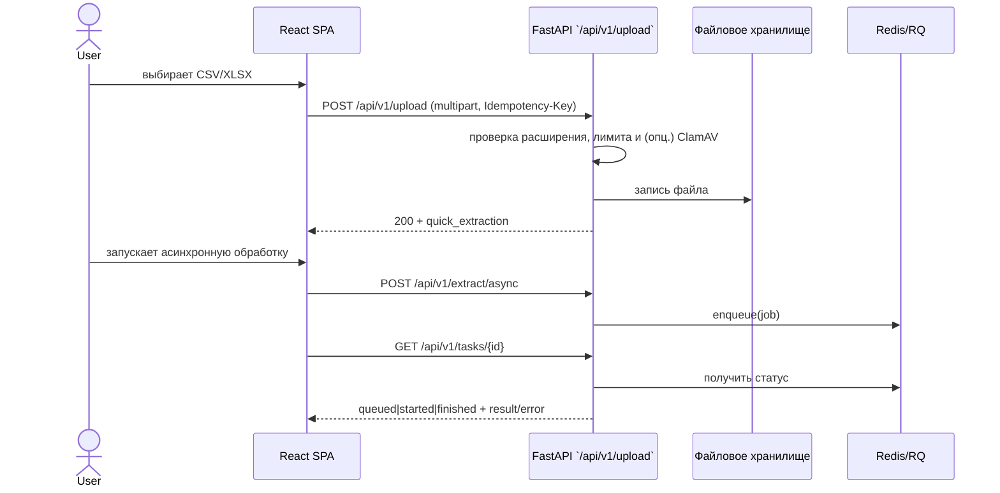
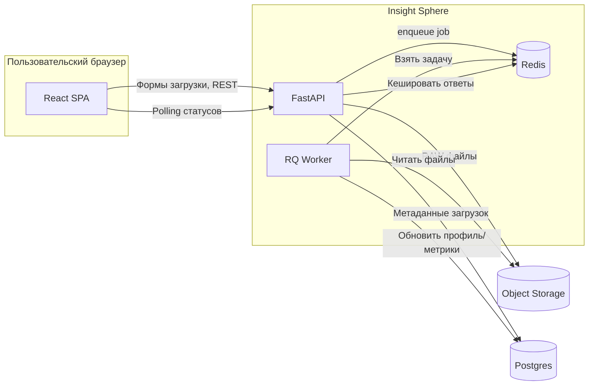

# Архитектура Insight Sphere

## Обзор

Система состоит из одностраничного приложения на React (Vite) и API на FastAPI. Пользователи
загружают табличные данные, получают моментальные инсайты и могут запускать асинхронные задачи
обработки через очередь Redis/RQ. Ограничения по размеру файла и проверка ClamAV защищают систему
от злоупотреблений.

## C4 — Контекст

```mermaid
C4Context
    title Insight Sphere — контекст
    Person(user, "Аналитик", "Загружает и исследует наборы данных")
    System(frontend, "Insight Sphere UI", "React + Vite")
    System(api, "Insight Sphere API", "FastAPI")
    System_Ext(storage, "Файловое хранилище", "Локальный диск / S3 совместимый бакет")
    System_Ext(redis, "Redis", "Очередь задач и кэш")
    user -> frontend : управляет загрузками и визуализациями
    frontend -> api : REST `/api/v1`
    api -> storage : сохраняет файлы
    api -> redis : ставит задачи и читает статусы
```

## C4 — Контейнеры

```mermaid
C4Container
    title Insight Sphere — контейнеры
    Person(user, "Аналитик")
    System_Boundary(system, "Insight Sphere") {
        Container(ui, "React SPA", "Vite, React Query", "UI, формы загрузки, визуализации")
        Container(api, "FastAPI", "Python", "Проверка файлов, генерация метаданных, REST API")
        Container(worker, "RQ worker", "Python", "Асинхронная обработка и генерация отчётов")
    }
    ContainerDb(files, "Uploads", "Файловая система / S3", "Загруженные исходные данные")
    ContainerDb(redis, "Redis", "In-memory store", "Очередь задач и кэш статусов")
    user -> ui : HTTP(S)
    ui -> api : REST `/api/v1`
    api -> files : `PUT`/`GET`
    api -> redis : Push job / poll status
    worker -> files : читает данные
    worker -> redis : обновляет статусы задач
```

## C4 — Компоненты (API слой)

```mermaid
C4Component
    title Insight Sphere — компоненты API
    Component_Boundary(api, "FastAPI Application") {
        Component(upload, "UploadController", "FastAPI", "Обработка загрузок и метаданных")
        Component(tasks, "TaskController", "FastAPI", "REST для постановки и чтения задач")
        Component(service, "IngestionService", "Python сервис", "Валидация и профилирование данных")
        Component(repo, "DatasetRepository", "SQLModel", "CRUD поверх Postgres")
    }
    Component_Boundary(worker, "RQ Worker") {
        Component(job, "ProcessDatasetJob", "RQ job", "Аналитика, агрегации, обновление статуса")
    }
    ContainerDb(db, "Postgres", "Managed Postgres", "Метаданные загрузок, профили, задания")
    Container(files, "Object Storage", "S3 совместимое", "Сырые файлы и экспорт")
    Rel(upload, service, "Создаёт задание на профилирование", "Python")
    Rel(service, repo, "Транзакции", "SQL")
    Rel(tasks, repo, "Читает и обновляет статусы", "SQL")
    Rel(job, repo, "Обновление результатов", "SQL")
    Rel(upload, files, "PUT объектов", "S3 API")
    Rel(job, files, "GET исходных файлов", "S3 API")
    Rel(repo, db, "SQLAlchemy", "TCP/5432")
```

## Последовательность загрузки



## Потоки данных



## Ограничения загрузок

- Размер файла ограничен `MAX_UPLOAD_SIZE_MB` (25 МБ по умолчанию).
- Допустимые расширения: `.csv`, `.tsv`, `.xlsx`, `.xls` (настраиваются).
- Опциональная проверка ClamAV через `CLAMAV_SCAN_URL`.
- Заголовок `Idempotency-Key` обеспечивает повторяемость запросов.

## Очереди и фоновые задачи

- Флаг `TASK_QUEUE_ENABLED` активирует Redis/RQ.
- `/api/v1/extract/async` ставит задачу в очередь `TASK_QUEUE_NAME`.
- `/api/v1/tasks/{task_id}` возвращает `queued|started|finished|failed` и итоговый payload.
- Рабочие процессы запускаются командой `python -m app.worker`.

## Провайдер вычислений для ИИ

- Сервис AI Compute Provider поднимается отдельно и подписывается на поток `ai:jobs` в Redis
  Streams.
- Планировщик распределяет задачи между CPU- и GPU-очередями, контролируя доступную VRAM и
  переключаясь на деградированный режим на CPU при нехватке ресурсов.
- Метрики ожидания, загрузки GPU и профили PyTorch/Nsight публикуются в Prometheus и доступны
  через API `/api/v1/ai/jobs/*`.
- Детали реализации, конфигурации и профайлинга описаны в документе
  [docs/ai_compute_provider.md](ai_compute_provider.md).

## Документация API и контрактные тесты

- OpenAPI схема фиксируется снапшотом `backend/app/tests/snapshots/openapi_v1.json`.
- Контракт между фронтом и API описан Pact-файлом `contracts/pacts/insight-frontend-insight-backend.json`.
- Провайдерские тесты (`pytest -m contract`) и потребительские (`npm run test:contracts`) проверяют
  совместимость.

## Нагрузочные проверки

- Скрипт `tests/load/upload.js` (k6) моделирует массовые загрузки.
- Целевые SLO: `p(95) < 2.5s`, `error rate < 1%`.

## SLA и операционные цели

| Метрика | Цель | Механизмы обеспечения |
| --- | --- | --- |
| Доступность API | 99.5% в месяц | Health-check `/healthz`, авто-ребут контейнеров, мониторинг в Grafana |
| Время отклика загрузки (p95) | ≤ 2.5 секунды | Пул воркеров Gunicorn/Uvicorn, оптимизация SQL запросов, CDN для статичных ресурсов |
| Время обработки фоновой задачи (p90) | ≤ 10 минут | Горизонтальное масштабирование воркеров RQ, приоритезация очереди |
| RPO | ≤ 15 минут | PITR бэкапы Postgres, версионирование файлов в объектном хранилище |
| RTO | ≤ 30 минут | Автоматизированные playbook-и восстановления, инфраструктура как код |

## Дополнительные материалы

- Pydantic Settings читает конфиги из расшифрованного SOPS-файла (`env`-секция) и переменных
  окружения.
- `secrets/example.secrets.yaml` содержит список обязательных параметров и рекомендации по
  ротации.
- Для продакшена используются Helm values и secrets менеджер.
- [ADR 0002](adr/0002-file-storage-and-queues.md) — детальное решение по хранению и очередям.
- [README](../README.md) — инструкции по запуску и качеству.
